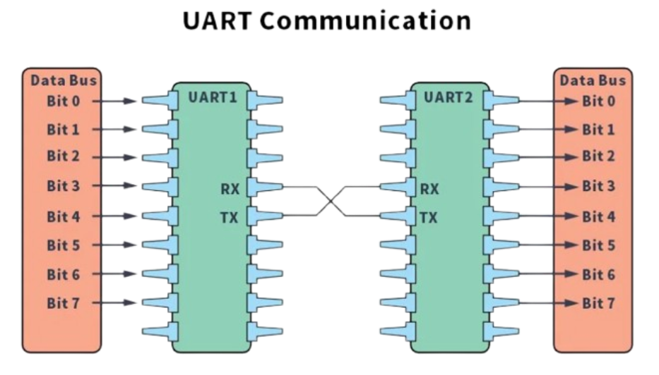

# Implementation-of-UART-Protocol-on-FPGA
## Abstract

This project presents the design and implementation of a **UART (Universal Asynchronous Receiver Transmitter)** controller on FPGA using Verilog. The system is implemented on the **Nexys A7 (Artix-7) board** and enables serial communication between the FPGA and a PC via the PuTTY terminal.

The design follows a **modular architecture**, consisting of a baud rate generator, transmitter (TX), and receiver (RX). It supports **8-bit data transmission**, uses **16x oversampling** in the receiver for improved reliability, and ensures proper synchronization using baud-rate-based enable signals. The implementation is verified on real hardware, demonstrating successful bidirectional communication.

---

## Introduction

UART (Universal Asynchronous Receiver Transmitter) is a widely used serial communication protocol that enables data exchange between devices without requiring a shared clock signal. Instead, both transmitter and receiver operate at a predefined **baud rate**, which determines the speed of data transmission.

Data in UART is transmitted in the form of frames, typically consisting of a **start bit (logic 0)**, followed by **data bits (usually 8 bits, LSB first)**, and one or more **stop bits (logic 1)**. Since communication is asynchronous, accurate timing is essential for correct data interpretation.
!
[UART_Frame](uart_frame.png)

To improve reliability, especially in the presence of noise or timing variations, UART receivers often employ **oversampling techniques**. In this design, **16x oversampling** is used, where each bit is sampled multiple times and the optimal sampling point is selected to ensure accurate data recovery.

Due to its simplicity and efficiency, UART is commonly used in **FPGA-to-PC communication**, embedded systems, and debugging interfaces.

---

## Architecture

The UART design is divided into three main modules:

### Baud Rate Generator

The baud rate generator produces timing enable signals required for transmission and reception. It derives lower-frequency enable pulses from the high-frequency system clock (100 MHz).

- `tx_enb` controls transmission timing  
- `rx_enb` is used for 16x oversampling in reception  

---

### Transmitter (TX)

The transmitter converts parallel data into serial form using a Finite State Machine (FSM).  
It follows the UART frame format:

- Start bit (0)  
- 8-bit data (LSB first)  
- Stop bit (1)  

Transmission is controlled using the baud rate enable signal.

---

### Receiver (RX)

The receiver reconstructs serial data into parallel form. It uses **16x oversampling** to accurately sample incoming bits and improve noise immunity.

- Detects start bit  
- Samples data at mid-bit position  
- Shifts received bits into a register  
- Outputs 8-bit parallel data  

---

## Working Principle

Data is sent from the PC via PuTTY to the FPGA over a serial connection. The receiver module detects and samples the incoming data stream, reconstructs it into parallel format, and makes it available as output. Similarly, the transmitter module sends data from FPGA to PC when enabled.

---

## Hardware Setup

- FPGA Board: **Nexys A7 (Artix-7)**  
- Connect FPGA **RX → PC TX**  
- Connect FPGA **TX → PC RX**  
- Ensure **common ground** between FPGA and PC  

---

## PuTTY Configuration

To establish communication, configure PuTTY with the following settings:

- Baud Rate: 9600  
- Data Bits: 8  
- Stop Bits: 1  
- Parity: None  
- Flow Control: None  

---

## Results

- Successful UART communication between FPGA and PC  
- Accurate data transmission and reception  
- Verified on **Nexys A7 hardware using PuTTY terminal**  

*(Add screenshots / demo video here)*

---

## 📚 Conclusion

This project demonstrates a complete UART implementation on FPGA using modular RTL design and oversampling techniques. Implemented on the Nexys A7 board, it highlights essential concepts required for reliable asynchronous communication in digital systems.

---

## 👨‍💻 Author

**Ajay Boddu**  
B.Tech | VLSI | FPGA Developer  

---
